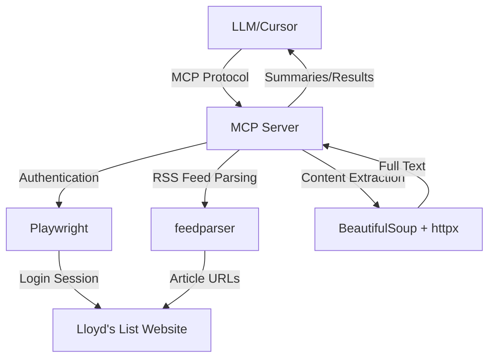

# Lloyd's List MCP Server

## Project Overview

**Purpose:** A Model Context Protocol (MCP) server that enables LLMs (via Cursor) to access Lloyd's List maritime news articles, providing comprehensive maritime intelligence data.

**Tech Stack:**
- Python 3.10+
- MCP SDK (`mcp-use`)
- `feedparser` - RSS feed parsing
- `playwright` - Browser automation for authentication
- `beautifulsoup4` - HTML parsing and content extraction
- `httpx` - Modern async HTTP client
- `pytest` - Testing framework

**Core Functionality:**
- Parse Lloyd's List RSS feeds across multiple sectors and topics
- Handle authentication to access full article content behind paywall
- Search and filter articles by keyword, sector, and category
- Extract and clean article content
- Generate article summaries
- Provide 5 MCP tools for LLM interaction

**Target Users:** LLMs accessing maritime intelligence data through Cursor IDE

## Code Conventions

### Python Best Practices

- **Follow PEP 8 style guide** for all code formatting
- **Use type hints** for all function parameters and return values
- **Prefer composition over inheritance** when designing classes
- **Use async/await** for all I/O operations (httpx, Playwright)
- **Keep functions focused and single-purpose** - each function should do one thing well
- **Error handling:** Use specific exceptions and handle errors gracefully
- **Avoid global state** - prefer dependency injection

### Module Structure

- **Use explicit `__all__` exports** to define public APIs in each module
- **Import conventions:** Group imports in this order:
  1. Standard library imports
  2. Third-party imports
  3. Local application imports
- **Prefer absolute imports** over relative imports
- **Module organization:** One class per file for major components, related utilities can share a file

### Documentation Requirements

All public functions and classes **must have docstrings** using Google or NumPy style format.

**Required docstring elements:**
- Brief one-line summary
- Detailed description (if needed)
- Args section with type information
- Returns section with type information
- Raises section documenting exceptions

**Example:**

```python
def search_articles(query: str, sector: str | None = None, limit: int = 10) -> list[dict]:
    """Search for articles by keyword across RSS feeds.
    
    Searches all available Lloyd's List RSS feeds for articles matching
    the provided query. Results can be filtered by sector and limited
    to a maximum number of results.
    
    Args:
        query: Search keywords to match against article titles/content
        sector: Optional sector filter (Containers, Dry Bulk, Tankers & Gas, etc.)
        limit: Maximum number of results to return (default: 10)
    
    Returns:
        List of article dictionaries containing:
            - title (str): Article title
            - url (str): Article URL
            - date (datetime): Publication date
            - snippet (str): Brief content excerpt
    
    Raises:
        ValueError: If query is empty or limit is negative
        ConnectionError: If RSS feeds are unreachable
    """
    pass
```

### Naming Conventions

- **Functions and variables:** `snake_case`
- **Classes:** `PascalCase`
- **Constants:** `UPPER_SNAKE_CASE`
- **Private methods/attributes:** Prefix with single underscore `_private_method`
- **Module names:** `snake_case.py`

**Examples:**
```python
# Good
class ArticleFetcher:
    MAX_RETRIES = 3
    
    def __init__(self):
        self._session = None
    
    def fetch_article(self, url: str) -> dict:
        pass
    
    def _validate_url(self, url: str) -> bool:
        pass

# Bad
class article_fetcher:  # Should be PascalCase
    max_retries = 3  # Constant should be UPPER_SNAKE_CASE
    
    def FetchArticle(self, url: str) -> dict:  # Should be snake_case
        pass
```

## Architecture

### System Architecture Diagram



### Component Descriptions

#### `server.py` - MCP Server Entry Point

Main MCP server implementation using the `mcp-use` SDK.

**Responsibilities:**
- Initialize MCP server instance
- Register all MCP tools using `@server.tool()` decorator
- Handle async tool execution
- Coordinate between RSS parser, authenticator, and article fetcher

**MCP Tools Implemented:**
1. `search_articles` - Search for articles by keyword with optional filters
2. `get_latest_articles` - Get recent articles from specific feeds
3. `get_article_content` - Fetch full article text (requires authentication)
4. `summarize_articles` - Generate summaries of one or more articles
5. `list_available_feeds` - List all available RSS feeds by type

#### `rss_parser.py` - RSS Feed Management

Handles all RSS feed operations.

**Responsibilities:**
- Maintain mapping of feed types, names, and URLs
- Fetch and parse RSS feeds using `feedparser`
- Cache feed data with timestamps to minimize requests
- Extract metadata from feed entries
- Handle feed errors gracefully

**Key Features:**
- Async feed fetching using httpx
- Feed categories: Sectors, Topics, Regular feeds
- TTL-based cache invalidation

#### `authenticator.py` - Authentication & Session Management

Manages authentication to Lloyd's List using Playwright with interactive browser login.

**Responsibilities:**
- Browser automation for login flow
- Session persistence using `storage_state` JSON
- Cookie extraction for httpx client
- Re-authentication when session expires
- Interactive browser UI for user login

**Authentication Flow:**
1. Check for existing `auth.json` storage state file
2. If missing or expired, launch Playwright in **visible mode** (non-headless)
3. Open browser window with Lloyd's List login page
4. **User logs in manually** through the actual website UI
5. Wait for successful authentication and save session with `context.storage_state(path='auth.json')`
6. Extract cookies for httpx reuse
7. Handle re-authentication automatically when session expires

#### `article_fetcher.py` - Article Content Extraction

Extracts full article content from authenticated sessions.

**Responsibilities:**
- Use authenticated httpx client with Playwright cookies
- Parse HTML using BeautifulSoup4
- Extract main article content using CSS selectors
- Clean HTML and extract plain text
- Detect and handle paywall errors
- Handle network errors and retries

**Key Features:**
- Reuses authentication cookies from Playwright
- Async httpx requests for performance
- Robust error handling

#### `summarizer.py` - Article Summarization

Generates article summaries in different formats.

**Responsibilities:**
- Process article text for summarization
- Support multiple summary modes: brief, detailed, full
- Leverage LLM via MCP protocol or local model
- Batch summarization for multiple articles

## Testing

### Test Structure

```
tests/
├── test_rss_parser.py       # RSS feed parsing tests
├── test_authenticator.py    # Authentication flow tests
├── test_article_fetcher.py  # Article extraction tests
├── test_server.py           # MCP server integration tests
└── conftest.py              # Shared fixtures and configuration
```

### pytest Commands

**Run all tests:**
```bash
pytest
```

**Run specific test file:**
```bash
pytest tests/test_rss_parser.py
```

**Run with coverage report:**
```bash
pytest --cov=src/lloyds_list_mcp --cov-report=html
```

**Run verbose mode:**
```bash
pytest -v
```

**Run specific test function:**
```bash
pytest tests/test_rss_parser.py::test_parse_feed_entry
```

**Run tests matching pattern:**
```bash
pytest -k "authentication"
```

**Run with output (see print statements):**
```bash
pytest -s
```

### Testing Guidelines

**General Principles:**
- Use `pytest` fixtures for common setup (mock feeds, auth states, temp directories)
- Use `pytest-asyncio` for testing async functions
- Mock external dependencies (httpx requests, Playwright browser, RSS feeds)
- Use `pytest-mock` or `unittest.mock` for mocking
- **Target:** 80%+ code coverage on core modules
- Test error handling and edge cases, not just happy paths
- Use descriptive test names that explain what is being tested

**Dependencies for Testing:**
- `pytest` - Test framework
- `pytest-asyncio` - Async test support
- `pytest-mock` - Enhanced mocking capabilities
- `pytest-cov` - Coverage reporting
- `httpx` - HTTP client (also used for mocking)

### Example Test Pattern

```python
import pytest
from unittest.mock import AsyncMock, patch, MagicMock

@pytest.mark.asyncio
async def test_search_articles_with_sector_filter():
    """Test article search with sector filtering."""
    # Arrange
    mock_parser = AsyncMock()
    mock_parser.get_feed_entries.return_value = [
        {"title": "Container shipping rates rise", "sector": "Containers"},
        {"title": "Container port congestion", "sector": "Containers"},
    ]
    
    # Act
    results = await search_articles(
        query="shipping",
        sector="Containers",
        limit=5
    )
    
    # Assert
    assert len(results) == 2
    assert all("container" in r["title"].lower() for r in results)
    mock_parser.get_feed_entries.assert_called_once()
```

### Required Test Fixtures

Create these fixtures in `conftest.py`:

**`mock_rss_feed`** - Sample RSS feed data
```python
@pytest.fixture
def mock_rss_feed():
    """Provide sample RSS feed data for testing."""
    return {
        'feed': {'title': 'Lloyd\'s List - Containers'},
        'entries': [
            {
                'title': 'Container rates surge',
                'link': 'https://lloydslist.com/article/123',
                'published': 'Mon, 20 Jan 2026 10:00:00 GMT',
                'summary': 'Container shipping rates increased...'
            }
        ]
    }
```

**`mock_auth_session`** - Mock Playwright storage state
```python
@pytest.fixture
def mock_auth_session(tmp_path):
    """Provide mock authentication session state."""
    auth_file = tmp_path / "auth.json"
    auth_data = {
        "cookies": [
            {"name": "session_id", "value": "mock_session_123"}
        ]
    }
    auth_file.write_text(json.dumps(auth_data))
    return str(auth_file)
```

**`mock_article_html`** - Sample article HTML for parsing tests
```python
@pytest.fixture
def mock_article_html():
    """Provide sample article HTML for parsing."""
    return """
    <html>
        <article class="article-content">
            <h1>Test Article Title</h1>
            <div class="article-body">
                <p>Article content goes here.</p>
            </div>
        </article>
    </html>
    """
```

**`temp_cache_dir`** - Temporary directory for cache testing
```python
@pytest.fixture
def temp_cache_dir(tmp_path):
    """Provide temporary cache directory."""
    cache_dir = tmp_path / "cache"
    cache_dir.mkdir()
    return cache_dir
```

## Setup & Installation

### Initial Setup

```bash
# Clone the repository
cd lloyds-list-mcp

# Create virtual environment
python -m venv venv
source venv/bin/activate  # On Windows: venv\Scripts\activate

# Install dependencies
pip install -r requirements.txt

# Install Playwright browsers (required for authentication)
playwright install chromium

# Optional: Configure environment variables for custom settings
cp config/.env.example .env
# Edit .env if you want to customize cache directory, log level, etc.
```

### Configuration

Create a `.env` file in the project root with the following variables (all optional):

**Optional Configuration:**
- `CACHE_DIR` - Directory for RSS feed cache (default: `.cache`)
- `AUTH_STATE_FILE` - Path to Playwright auth state (default: `auth.json`)
- `FEED_CACHE_TTL` - Feed cache TTL in seconds (default: `300`)
- `LOG_LEVEL` - Logging level (default: `INFO`)

**Authentication:**
- No credentials needed in `.env` file
- Users authenticate via **interactive browser login** when first running the server
- A browser window will open showing the Lloyd's List login page
- Log in manually through the website UI
- Session is saved to `auth.json` for future use
- Re-authentication is triggered automatically when the session expires

### Running the MCP Server

```bash
# Activate virtual environment
source venv/bin/activate

# Run the MCP server
python -m lloyds_list_mcp.server
```

**First Run:**
- A browser window will open automatically
- Log in to Lloyd's List using your account credentials
- Browser will close after successful authentication
- Session is saved for future use

**Subsequent Runs:**
- Server uses saved session from `auth.json`
- No browser window needed unless session expires
- The server will connect via stdio and can be used by Cursor or other MCP clients

## Security Notes

**Critical - Never commit sensitive files:**
- `auth.json` - Contains session cookies (generated after first login)
- `.env` - Optional configuration file
- `*.pyc`, `__pycache__/` - Python bytecode
- `.cache/` - Cached feed data

**Session Management:**
- Session cookies are stored locally in `auth.json` after interactive login
- No passwords are stored anywhere in the system
- Session files contain sensitive cookies - ensure they're in `.gitignore`
- Never hardcode credentials in source code

**Best Practices:**
- Interactive browser login provides better security (no password storage)
- Works seamlessly with MFA/2FA if enabled on your Lloyd's List account
- Session cookies expire automatically based on Lloyd's List security policies
- Clear `auth.json` and cache files when sharing development environments

## Workflow & Development

### Updating AGENTS.md

Keep this file updated as the project evolves:
- Document any new MCP tools added to the server
- Update architecture diagram if components change
- Add new testing patterns as they emerge
- Document new environment variables or configuration options

### Adding New MCP Tools

When adding a new MCP tool:

1. Define the tool in `server.py` using `@server.tool()` decorator
2. Add comprehensive docstring with parameter and return types
3. Create unit tests in `tests/test_server.py`
4. Update this AGENTS.md file in the Architecture section
5. Update README.md with usage examples

### Code Review Checklist

Before submitting code:
- [ ] All functions have type hints
- [ ] All public functions have docstrings
- [ ] New code has unit tests
- [ ] Tests pass: `pytest`
- [ ] Coverage meets 80% threshold: `pytest --cov`
- [ ] Code follows PEP 8 style guide
- [ ] No credentials or secrets in code
- [ ] `.gitignore` updated for new generated files

## Dependencies

**Core Dependencies:**
- `mcp-use` - MCP Python SDK
- `feedparser` - RSS/Atom feed parsing
- `playwright` - Browser automation
- `beautifulsoup4` - HTML parsing
- `httpx` - Async HTTP client
- `python-dotenv` - Environment variable management

**Development Dependencies:**
- `pytest` - Testing framework
- `pytest-asyncio` - Async test support
- `pytest-mock` - Mocking utilities
- `pytest-cov` - Coverage reporting

## Project Structure

```
lloyds-list-mcp/
├── src/
│   └── lloyds_list_mcp/
│       ├── __init__.py
│       ├── server.py              # MCP server entry point
│       ├── rss_parser.py          # RSS feed management
│       ├── authenticator.py       # Authentication & sessions
│       ├── article_fetcher.py     # Article content extraction
│       └── summarizer.py          # Article summarization
├── tests/
│   ├── conftest.py                # Shared test fixtures
│   ├── test_rss_parser.py
│   ├── test_authenticator.py
│   ├── test_article_fetcher.py
│   └── test_server.py
├── config/
│   └── .env.example               # Environment variable template
├── .env                           # Local environment config (gitignored)
├── .gitignore
├── requirements.txt               # Python dependencies
├── README.md
├── AGENTS.md                      # This file
└── LICENSE
```

## References

- [Lloyd's List Implementation Plan](/Users/joelong/.cursor/plans/lloyd's_list_mcp_server_a28ba565.plan.md)
- [AGENTS.md Best Practices](https://agents.md/)
- [PEP 8 Style Guide](https://peps.python.org/pep-0008/)
- [PEP 484 Type Hints](https://peps.python.org/pep-0484/)
- [pytest Documentation](https://docs.pytest.org/)
- [MCP Python SDK](https://mcp-use.python.org/)
