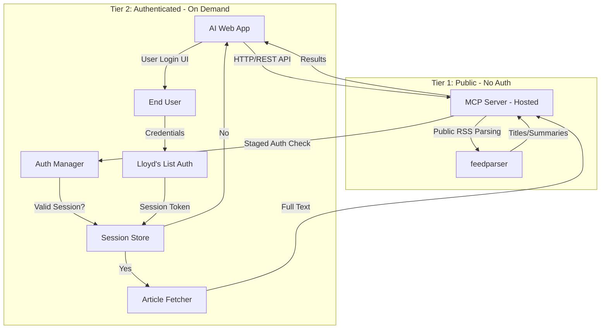

# Lloyd's List MCP Server

A Model Context Protocol (MCP) server that enables LLMs to access Lloyd's List maritime intelligence data. Provides both MCP tools for Cursor IDE integration and an optional HTTP API for web applications.

## Features

### Public Access (No Authentication)
- Search articles across all Lloyd's List RSS feeds by keyword
- Browse latest articles by sector (Containers, Dry Bulk, etc.) or topic (Decarbonisation, Red Sea Risk, etc.)
- Extract images from RSS feeds automatically
- List available feeds organized by category

### Intelligent Paywall Detection
- Automatically detects free vs. paywalled articles
- Only requests authentication when needed
- Session-based authentication to avoid repeated logins

### Dual Interface
- **MCP Protocol:** Direct integration with Cursor IDE via stdio
- **HTTP API:** Optional FastAPI-based REST endpoints for web applications
- OpenAPI documentation at `/docs`
- Deploy to hosting platforms (Render, Railway, Fly.io, Google Cloud Run)

## Quick Start

### Prerequisites

- Python 3.10+
- (Optional) Redis for production session storage

### Installation

1. **Clone the repository:**
```bash
git clone https://github.com/yourusername/lloyds-list-mcp.git
cd lloyds-list-mcp
```

2. **Create virtual environment:**
```bash
python -m venv venv
source venv/bin/activate  # On Windows: venv\Scripts\activate
```

3. **Install dependencies:**
```bash
pip install -r requirements.txt
```

4. **Install Playwright browsers:**
```bash
playwright install chromium
```

5. **Configure environment (optional):**
```bash
cp config/.env.example .env
# Edit .env to customize settings
```

### Running Locally

**Option 1: Run with uvicorn**
```bash
uvicorn src.lloyds_list_mcp.api:app --host 0.0.0.0 --port 8000 --reload
```

**Option 2: Run with Docker Compose (includes Redis)**
```bash
docker-compose up
```

Server will be available at `http://localhost:8000`

API documentation at `http://localhost:8000/docs`

## API Endpoints

### Public Endpoints (No Authentication)

#### Search Articles
```http
POST /api/search
Content-Type: application/json

{
  "query": "container shipping rates",
  "sector": "Containers",
  "limit": 10
}
```

**Response:**
```json
{
  "status": "success",
  "count": 5,
  "results": [
    {
      "title": "Container rates surge in Q1 2026",
      "url": "https://lloydslist.com/...",
      "date": "2026-01-20",
      "summary": "Container shipping rates increased 15%...",
      "image_url": "https://lloydslist.com/images/article.jpg",
      "tags": ["Containers", "Markets"],
      "author": "John Doe"
    }
  ]
}
```

#### Get Latest Articles
```http
POST /api/latest
Content-Type: application/json

{
  "feed_type": "sectors",
  "feed_name": "Containers",
  "limit": 10
}
```

#### List Available Feeds
```http
GET /api/feeds
```

**Response:**
```json
{
  "status": "success",
  "feeds": {
    "sectors": ["Containers", "Dry Bulk", "Tankers & Gas", ...],
    "topics": ["Decarbonisation", "Red Sea Risk", "Sanctions", ...],
    "regulars": ["Daily Briefing", "The View", "Podcasts & Video", ...]
  }
}
```

### Authenticated Endpoints (For Paywalled Content)

#### Get Article Content (with Paywall Detection)
```http
POST /api/article
Content-Type: application/json

{
  "article_url": "https://lloydslist.com/LL1156104/...",
  "user_session": null  // Optional - only needed if paywalled
}
```

**Response if free to read:**
```json
{
  "status": "success",
  "paywall": false,
  "content": {
    "title": "Article title",
    "full_text": "Complete article text...",
    "images": [...],
    "author": "Author name",
    "date": "2026-01-20",
    "tags": ["Containers"]
  }
}
```

**Response if paywalled + no session:**
```json
{
  "status": "authentication_required",
  "paywall": true,
  "message": "This article requires a Lloyd's List subscription",
  "url": "https://lloydslist.com/..."
}
```

#### Authenticate User
```http
POST /api/auth/login
Content-Type: application/json

{
  "username": "your.email@example.com",
  "password": "your-password"
}
```

**Response:**
```json
{
  "status": "success",
  "message": "Authentication successful",
  "session_token": "abc123...",
  "expires_in": 86400
}
```

#### Summarize Articles
```http
POST /api/summarize
Content-Type: application/json

{
  "article_urls": ["https://lloydslist.com/LL1156104/..."],
  "summary_length": "brief",  // "brief", "detailed", or "full"
  "user_session": null  // Optional - required for detailed/full if paywalled
}
```

## Architecture



## Deployment

### Deploy to Render (Free Tier)

1. Create a Render account at https://render.com

2. Create a new Web Service:
   - Connect your GitHub repository
   - Environment: Docker
   - Use Dockerfile in root

3. Add environment variables:
   ```
   SESSION_STORE=memory
   SESSION_SECRET_KEY=your-random-secret-key
   LOG_LEVEL=INFO
   ```

4. Deploy

Your API will be available at `https://your-app.onrender.com`

### Alternative Platforms

- **Railway:** One-click deploy from GitHub
- **Fly.io:** `flyctl deploy` CLI
- **Google Cloud Run:** Container deployment via gcloud

## Configuration

Environment variables (optional - defaults provided):

```bash
# Server
HOST=0.0.0.0
PORT=8000
LOG_LEVEL=INFO

# Cache
CACHE_DIR=.cache
FEED_CACHE_TTL=300

# Session Management
SESSION_STORE=memory  # or 'redis'
REDIS_URL=redis://localhost:6379/0
SESSION_TTL=86400  # 24 hours
SESSION_SECRET_KEY=your-secret-key

# Deployment
ENVIRONMENT=production
```

## Development

### Running Tests
```bash
pytest
```

### Code Quality
```bash
# Format code
black src/

# Lint
ruff src/

# Type check
mypy src/
```

## Security

- No credentials stored on server
- Sessions encrypted at rest
- Passwords never logged
- Sessions expire automatically
- Staged authentication (only when needed)

## MCP Tools (for Direct MCP Usage)

If using the server directly via MCP protocol:

- `search_articles(query, sector?, category?, limit?)` - Search public RSS feeds
- `get_latest_articles(feed_type, feed_name, limit?)` - Get recent articles
- `list_available_feeds()` - List all feeds
- `get_article_content(article_url, user_session?)` - Fetch full article (paywall-aware)
- `authenticate_user(username, password)` - Create authenticated session
- `summarize_articles(article_urls, summary_length, user_session?)` - Generate summaries

## Tech Stack

- **MCP SDK:** mcp-use (Python)
- **Web Framework:** FastAPI
- **RSS Parsing:** feedparser
- **Authentication:** Playwright (browser automation)
- **HTML Parsing:** BeautifulSoup4
- **HTTP Client:** httpx
- **Session Storage:** Redis (production) or in-memory (dev)

## License

Apache License 2.0 - See [LICENSE](LICENSE) for details.

## Contributing

Contributions welcome! Please see [AGENTS.md](AGENTS.md) for development guidelines.

## Support

For issues or questions:
- Open a GitHub issue
- Check API documentation at `/docs`
- Review [AGENTS.md](AGENTS.md) for implementation details
